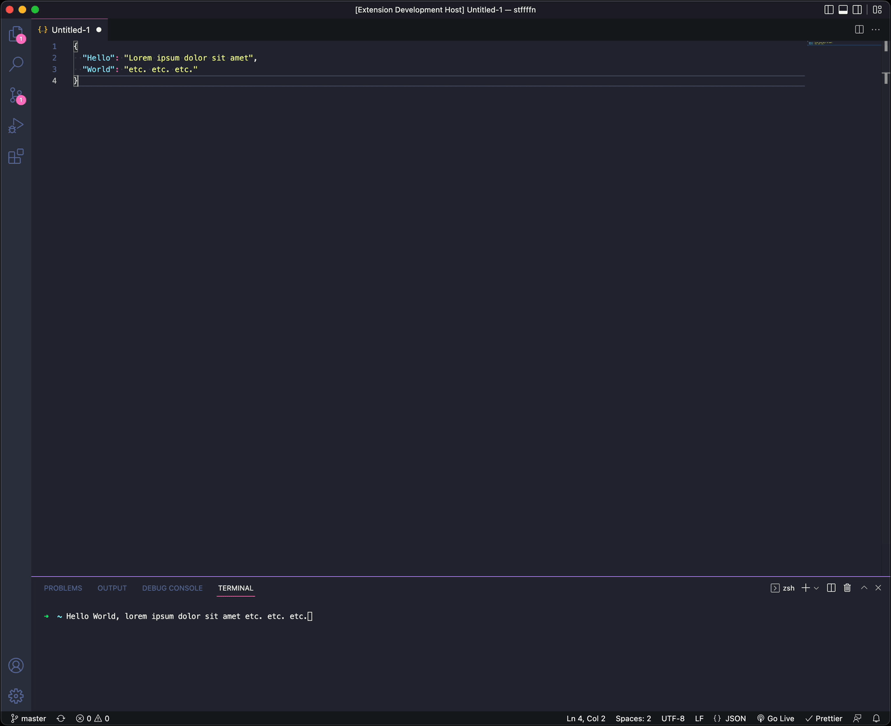

# VS Code Comic Mono

## What it does

Upon activation this extension changes your font to Comic Mono and increases the window zoom level to 2 and resets everything to the previous settings once it is deactivated.

## Prerequisities

Install [Comic Mono](https://github.com/dtinth/comic-mono-font)

## Installation

1. Download or clone this repository
2. Install the packages with `npm i`
3. Compile the extension with `npm run compile`
4. Copy the folder to:
   - Windows: `%USERPROFILE%\.vscode\extensions`
   - macOS: `~/.vscode/extensions`
   - Linux: `~/. vscode/extensions`
5. Restart VS Code if it was already running
6. Done

## Usage

Open the command palette:

- macOS: <kbd>Cmd</kbd> + <kbd>Shift</kbd> + <kbd>P</kbd>
- Windows: <kbd>Ctrl</kbd> + <kbd>Shift</kbd> + <kbd>P</kbd>

### Activate

Run `COMIC MODE: On`

### Deactivate

Run `COMIC MODE: Off`
